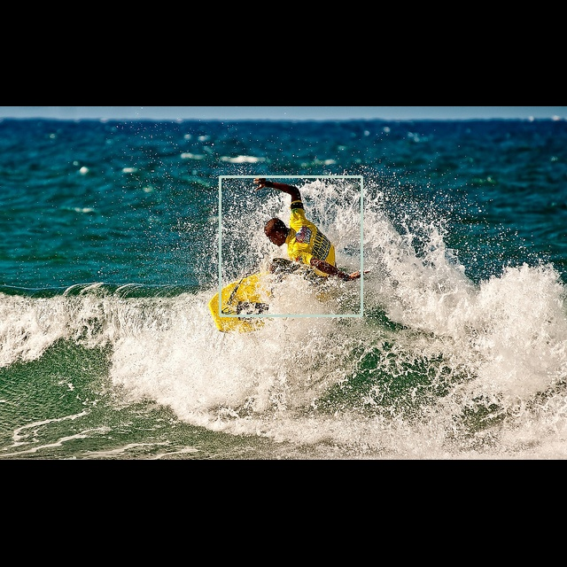
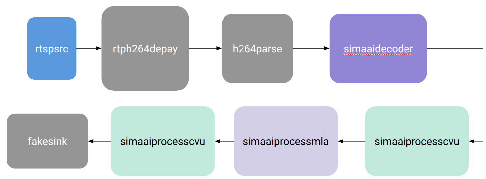
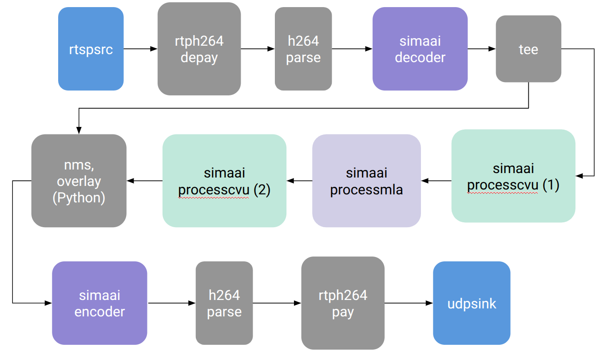

# YoloX Object Detection #

This tutorial demonstrates the following steps:

  * Running a trained FP32 ONNX model to provide baseline results.
  * Loading, Quantizing and Compiling of the trained FP32 model.
  * Evaluation of the quantized model.
  * Benchmarking of the compiled model.
  * Executing a compiled model on a hardware platform.
  * Building a GStreamer pipeline with IP camera input


## Starting the Palette SDK docker container ##

The docker container can be started by running the start.py script from the command line:

```shell
python start.py
```
When asked for the work directory, just respond with `./`


The output in the console should look something like this:

```shell
/home/projects/modelsdk_accelmode/./start.py:111: SyntaxWarning: invalid escape sequence '\P'
  docker_start_cmd = 'cmd.exe /c "start "" "C:\Program Files\Docker\Docker\Docker Desktop.exe""'
Set no_proxy to localhost,127.0.0.0
Using port 49152 for the installation.
Checking if the container is already running...
Enter work directory [/home/projects/modelsdk_accelmode]: ./
Starting the container: palettesdk_1_7_0_Palette_SDK_master_B219
Checking SiMa SDK Bridge Network...
SiMa SDK Bridge Network found.
Creating and starting the Docker container...
f72ae89b3c12494291a4b9f621f8d28f565705b8dd638fc058a79bfb5ce5e73c
Successfully copied 3.07kB to /home/projects/modelsdk_accelmode/passwd.txt
Successfully copied 3.07kB to palettesdk_1_7_0_Palette_SDK_master_B219:/etc/passwd
Successfully copied 2.56kB to /home/projects/modelsdk_accelmode/shadow.txt
Successfully copied 2.56kB to palettesdk_1_7_0_Palette_SDK_master_B219:/etc/shadow
Successfully copied 2.56kB to /home/projects/modelsdk_accelmode/group.txt
Successfully copied 2.56kB to palettesdk_1_7_0_Palette_SDK_master_B219:/etc/group
Successfully copied 3.58kB to /home/projects/modelsdk_accelmode/sudoers.txt
Successfully copied 3.58kB to palettesdk_1_7_0_Palette_SDK_master_B219:/etc/sudoers
Successfully copied 2.05kB to palettesdk_1_7_0_Palette_SDK_master_B219:/home/docker/.simaai/.port
user@f72ae89b3c12:/home$
```

Navigate into the working directory:

```shell
cd docker/sima-cli
```


## Execute Floating-Point ONNX model ##

ONNXRuntime is included in the SDK docker, so we can run the floating-point model. The run_onnx.py script includes pre- and postprocessing.


```shell
python run_onnx.py
```


The expected console output is like this:

```shell
user@c88084ef7e7b:/home/docker/sima-cli$ python run_onnx.py 

--------------------------------------------------
3.10.12 (main, Aug  6 2025, 18:09:36) [GCC 11.4.0]
--------------------------------------------------
Using 10 out of 10  test images
Removing existing directory: /home/docker/sima-cli/build/onnx_pred
Annotated images will be written to /home/docker/sima-cli/build/onnx_pred
Processing image: /home/docker/sima-cli/test_images/000000006894.jpg
Wrote output image to /home/docker/sima-cli/build/onnx_pred/test_000000006894.jpg
Processing image: /home/docker/sima-cli/test_images/000000019221.jpg
Wrote output image to /home/docker/sima-cli/build/onnx_pred/test_000000019221.jpg
Processing image: /home/docker/sima-cli/test_images/000000022589.jpg
Wrote output image to /home/docker/sima-cli/build/onnx_pred/test_000000022589.jpg
Processing image: /home/docker/sima-cli/test_images/000000032941.jpg
Wrote output image to /home/docker/sima-cli/build/onnx_pred/test_000000032941.jpg
Processing image: /home/docker/sima-cli/test_images/000000048504.jpg
Wrote output image to /home/docker/sima-cli/build/onnx_pred/test_000000048504.jpg
Processing image: /home/docker/sima-cli/test_images/000000572408.jpg
Wrote output image to /home/docker/sima-cli/build/onnx_pred/test_000000572408.jpg
Processing image: /home/docker/sima-cli/test_images/000000573626.jpg
Wrote output image to /home/docker/sima-cli/build/onnx_pred/test_000000573626.jpg
Processing image: /home/docker/sima-cli/test_images/000000574520.jpg
Wrote output image to /home/docker/sima-cli/build/onnx_pred/test_000000574520.jpg
Processing image: /home/docker/sima-cli/test_images/000000577735.jpg
Wrote output image to /home/docker/sima-cli/build/onnx_pred/test_000000577735.jpg
Processing image: /home/docker/sima-cli/test_images/000000581062.jpg
Wrote output image to /home/docker/sima-cli/build/onnx_pred/test_000000581062.jpg
```

Images annotated with bounding boxes are writted itno the ./build/onnx_pred folder.


## Quantize & Compile ##

The run_modelsdk.py script will do the following:

* load the floating-point ONNX model.
* quantize using pre-processed calibration data and quantization parameters set using command line arguments.
* test the quantized model accuracy using pre-processed images. Annotated images are written to build/quant_pred
* compile and then untar to extract the .elf and .json files (for use in benchmarking on the target board)

*Note: the quantization is done using min-max calibration method instead of the default mse method.*


```shell
python run_modelsdk.py -e
```

The images are written into build/quant_pred folder:


The expected console output is like this:

```shell
--------------------------------------------------
Model SDK version 1.7.0
3.10.12 (main, Aug  6 2025, 18:09:36) [GCC 11.4.0]
--------------------------------------------------
Removing existing directory: /home/docker/sima-cli/build/yolox_s_opt_no_reshapes
Results will be written to /home/docker/sima-cli/build/yolox_s_opt_no_reshapes
--------------------------------------------------
Model Inputs
images: (1, 3, 640, 640)
--------------------------------------------------
Loaded model from yolox_s_opt_no_reshapes.onnx
Quantizing with 50 calibration samples
Calibration Progress: |██████████████████████████████| 100.0% 50|50 Complete.  50/50
Running Calibration ...DONE
Running quantization ...DONE
Quantized model saved to /home/docker/sima-cli/build/yolox_s_opt_no_reshapes/yolox_s_opt_no_reshapes.sima.json
Removing existing directory: /home/docker/sima-cli/build/quant_pred
Annotated images will be written to /home/docker/sima-cli/build/quant_pred
Processing image: /home/docker/sima-cli/test_images/000000006894.jpg
Wrote output image to /home/docker/sima-cli/build/quant_pred/test_000000006894.jpg
Processing image: /home/docker/sima-cli/test_images/000000019221.jpg
Wrote output image to /home/docker/sima-cli/build/quant_pred/test_000000019221.jpg
Processing image: /home/docker/sima-cli/test_images/000000022589.jpg
Wrote output image to /home/docker/sima-cli/build/quant_pred/test_000000022589.jpg
Processing image: /home/docker/sima-cli/test_images/000000032941.jpg
Wrote output image to /home/docker/sima-cli/build/quant_pred/test_000000032941.jpg
Processing image: /home/docker/sima-cli/test_images/000000048504.jpg
Wrote output image to /home/docker/sima-cli/build/quant_pred/test_000000048504.jpg
Processing image: /home/docker/sima-cli/test_images/000000572408.jpg
Wrote output image to /home/docker/sima-cli/build/quant_pred/test_000000572408.jpg
Processing image: /home/docker/sima-cli/test_images/000000573626.jpg
Wrote output image to /home/docker/sima-cli/build/quant_pred/test_000000573626.jpg
Processing image: /home/docker/sima-cli/test_images/000000574520.jpg
Wrote output image to /home/docker/sima-cli/build/quant_pred/test_000000574520.jpg
Processing image: /home/docker/sima-cli/test_images/000000577735.jpg
Wrote output image to /home/docker/sima-cli/build/quant_pred/test_000000577735.jpg
Processing image: /home/docker/sima-cli/test_images/000000581062.jpg
Wrote output image to /home/docker/sima-cli/build/quant_pred/test_000000581062.jpg
Compiling with batch size set to 1
Wrote compiled model to /home/docker/sima-cli/build/yolox_s_opt_no_reshapes/yolox_s_opt_no_reshapes_mpk.tar.gz
```


The evaluation of the quantized model generates images annotated with bounding boxes and are written into the ./build/quant_pred folder.





## Test model on hardware ##

Run the model directly on the target board. This requires the target board to be reachable via ssh. Make sure to set the IP address of the target board:


```shell
python run_accelmode.py -hn <target_ip_address>
```


The output in the console will be something like this:


```shell
user@c88084ef7e7b:/home/docker/sima-cli$ python run_accelmode.py 

--------------------------------------------------
Model SDK version 1.7.0
3.10.12 (main, Aug  6 2025, 18:09:36) [GCC 11.4.0]
--------------------------------------------------
Removing existing directory: /home/docker/sima-cli/build/accel_pred
Annotated images will be written to /home/docker/sima-cli/build/accel_pred
Loading yolox_s_opt_no_reshapes quantized model from build/yolox_s_opt_no_reshapes
Using 10 out of 10  test images
Compiling model yolox_s_opt_no_reshapes to .elf file
Creating the Forwarding from host
Copying the model files to DevKit
Creating the Forwarding from host
ZMQ Connection successful.
Executing model graph in accelerator mode:
Progress: |██████████████████████████████| 100.0% 10|10 Complete.  10/10
Model is executed in accelerator mode.
Processing image: /home/docker/sima-cli/test_images/000000006894.jpg
Wrote output image to /home/docker/sima-cli/build/accel_pred/test_000000006894.jpg
Processing image: /home/docker/sima-cli/test_images/000000019221.jpg
Wrote output image to /home/docker/sima-cli/build/accel_pred/test_000000019221.jpg
Processing image: /home/docker/sima-cli/test_images/000000022589.jpg
Wrote output image to /home/docker/sima-cli/build/accel_pred/test_000000022589.jpg
Processing image: /home/docker/sima-cli/test_images/000000032941.jpg
Wrote output image to /home/docker/sima-cli/build/accel_pred/test_000000032941.jpg
Processing image: /home/docker/sima-cli/test_images/000000048504.jpg
Wrote output image to /home/docker/sima-cli/build/accel_pred/test_000000048504.jpg
Processing image: /home/docker/sima-cli/test_images/000000572408.jpg
Wrote output image to /home/docker/sima-cli/build/accel_pred/test_000000572408.jpg
Processing image: /home/docker/sima-cli/test_images/000000573626.jpg
Wrote output image to /home/docker/sima-cli/build/accel_pred/test_000000573626.jpg
Processing image: /home/docker/sima-cli/test_images/000000574520.jpg
Wrote output image to /home/docker/sima-cli/build/accel_pred/test_000000574520.jpg
Processing image: /home/docker/sima-cli/test_images/000000577735.jpg
Wrote output image to /home/docker/sima-cli/build/accel_pred/test_000000577735.jpg
Processing image: /home/docker/sima-cli/test_images/000000581062.jpg
Wrote output image to /home/docker/sima-cli/build/accel_pred/test_000000581062.jpg
```


The evaluation of the compiled model generates images annotated with bounding boxes and are written into the ./build/accel_pred folder.


## Benchmarking model on hardware ##

The model can be benchmarked on the target board. This uses random data to test the throughput - note that this only tests the MLA throughput.


```shell
python ./get_fps/network_eval/network_eval.py \
    --model_file_path   ./build/yolox_s_opt_no_reshapes/benchmark/yolox_s_opt_no_reshapes_stage1_mla.elf \
    --mpk_json_path     ./build/yolox_s_opt_no_reshapes/benchmark/yolox_s_opt_no_reshapes_mpk.json \
    --dv_host           192.168.1.29 \
    --image_size        640 640 3 \
    --verbose \
    --bypass_tunnel \
    --max_frames        100 \
    --batch_size        1
```

  The measured throughput in frames per second (FPS) will be printed in the console:

```shell
Running model in MLA-only mode
Copying the model files to DevKit
sima@192.168.1.29's password: 
FPS = 560
FPS = 566
FPS = 568
FPS = 569
FPS = 570
FPS = 571
FPS = 571
FPS = 571
FPS = 572
FPS = 572
Ran 100 frame(s)
```


## Building the GStreamer Pipeline ##


Create a baseline pipeline with this command:


```shell
mpk project create --model-path ./build/yolox_s_opt_no_reshapes/yolox_s_opt_no_reshapes_mpk.tar.gz --src-plugin rtspsrc --input-width 1280 --input-height 720
```


This will make a folder called 'yolox_s_opt_no_reshapes_mpk_rtspsrc' in which the baseline GStreamer pipeline is written.





We now need to modify a few files of this pipeline to make it work.


### Modify the Preprocessing Configuration File ###


Modify CVU configuration 0_preproc.json as follows:

  - change normalize to false: `"normalize": false,`
  - change input image type to NV12: `"input_img_type": "NV12",`


### Add the Python custom plugin ###


Modify .project/pluginsInfo.json to add a new plugin called 'yolox_postproc_overlay' - this will be the   :


```shell
{
    "pluginsInfo": [
        {
            "gid": "processcvu",
            "path": "plugins/processcvu"
        },
        {
            "gid": "processmla",
            "path": "plugins/processmla"
        },
        {
            "gid" : "yolox_postproc_overlay",
            "path" : "plugins/yolox_postproc_overlay"
        }
    ]
}

```

Add a folder to contain the custom Python plugin and copy the templates into it:

```shell
mkdir -p ./yolox_s_opt_no_reshapes_mpk_rtspsrc/plugins/yolovx_postproc_overlay
cp /usr/local/simaai/plugin_zoo/gst-simaai-plugins-base/gst/templates/aggregator_python/python/*.py ./yolox_s_opt_no_reshapes_mpk_rtspsrc/plugins/yolovx_postproc_overlay/.
```

copy contents of <...> into ./yolox_s_opt_no_reshapes_mpk_rtspsrc/plugins/yolovx_postproc_overlay/payload.py


Open 'application.json' and add the following into the "lugins" section of the JSON file:


```shell
    {
      "name": "simaai_yolovx_postproc_overlay",
      "pluginGid": "yolovx_postproc_overlay",
      "sequence" : 4
    }
```


### Change the Pipeline Structure ###

Replace the gst string in application.json with this:

```shell
    "gst": "rtspsrc location=<RTSP STREAM URL> ! rtph264depay wait-for-keyframe=true ! h264parse ! 'video/x-h264, parsed=true, stream-format=(string)byte-stream, alignment=(string)au, width=(int)[1,4096], height=(int)[1,4096]' ! simaaidecoder name=decoder sima-allocator-type=2 ! tee name=source ! queue2 ! simaaiprocesscvu  name=simaaiprocesspreproc_1 ! simaaiprocessmla  name=simaaiprocessmla_1 ! simaaiprocesscvu  name=simaaiprocessdetess_dequant_1 ! yolox_postproc_overlay  name='simaai_yolox_postproc_overlay' ! queue2 ! 'video/x-raw,format=NV12,width=1280,height=720,framerate=30/1' ! simaaiencoder enc-bitrate=4000 name=encoder1 ! h264parse ! rtph264pay ! udpsink host=<HOST IP ADDRESS> port=<HOST PORT NUMBER> source. ! queue2 ! simaai_yolox_postproc_overlay. "
```

Edit the gst string to insert your RTPS Stream URL, for example: *rtspsrc location=rtsp://192.168.1.20:8080/h264_ulaw.sdp*  - Check your IP camera details to find the correct URL.

Edit the gst string to insert your host machine IP address and port number, for example: *udpsink host=192.168.1.59 port=7000*


This new gst string gives the structure to the final pipeline:




### Edit Port Number in the Display Script ###

The host.sh script contains a Gstreamer command to display the output stream from the target board.  The UDP port number in the command must match the UDP port number used in the gst string in application.json. Open the host.sh with a text editor and modify the UDP port number, for example: *udpsrc port=7000*


### Compile and Deploy the Pipeline ###

Compile the pipeline:

```shell
mpk create --board-type modalix --clean -s ./yolox_s_opt_no_reshapes_mpk_rtspsrc -d ./yolox_s_opt_no_reshapes_mpk_rtspsrc
```

If it compiles correctly, then the console output will be similar to this:


```shell
user@c88084ef7e7b:/home/docker/sima-cli$ mpk create --board-type modalix --clean -s ./yolox_s_opt_no_reshapes_mpk_rtspsrc -d ./yolox_s_opt_no_reshapes_mpk_rtspsrc
ℹ Cleaning up build artifacts...
✔ Successfully cleaned up build artifacts.
ℹ Compiling a65-apps...
✔ a65-apps compiled successfully.
ℹ No changes detected in the plugin source code. Skipping compilation.
ℹ Processing Plugins...
ℹ Checking plugins info before writing...
ℹ Getting plugins info from cmake files...
✔ App yolox_s_opt_no_reshapes_mpk_rtspsrc: Plugin version info written to '/home/docker/sima-cli/yolox_s_opt_no_reshapes_mpk_rtspsrc/yolox_s_opt_no_reshapes_mpk_rtspsrc_plugin_version_index.json' Successfully.
✔ Processing Plugins is Successful.
ℹ Copying Resources...
✔ Resources Copied successfully.
ℹ Building Rpm...
✔ Rpm built successfully.
ℹ Creating mpk file...
✔ Mpk file created successfully at /home/docker/sima-cli/yolox_s_opt_no_reshapes_mpk_rtspsrc/project.mpk .
✔ Total time taken is 14.324 seconds.
```


Make sure the target board can be reached via ssh. Connect to the target with this command:

```shell
mpk device connect -d devkit -u <user name> -p <password> -t <target_ip_address>
```

Note: For Sima boards, the user name is 'sima' and the password is 'edgeai' 


Start the IP camera stream.
Open a terminal on the host machine (i.e. outside of the SDK docker container) and then start the display application (this is just a GStreamer command wrapped in an executable shell script):

```shell
sudo ./host.sh
```

The terminal will display the following text:

```shell
user@ubmsh2:~/projects/yolox$ sudo ./host.sh 
[sudo] password for user: 
Setting pipeline to PAUSED ...
Pipeline is live and does not need PREROLL ...
Pipeline is PREROLLED ...
Setting pipeline to PLAYING ...
New clock: GstSystemClock
```


Deploy the complete YoloX application:

```shell
mpk deploy -f ./yolox_s_opt_no_reshapes_mpk_rtspsrc/project.mpk -d devkit -t <target_ip_address>
```


## Files

* yolo_s.onnx -  original YoloX Small model (not used)
* yolox_surgery_no_reshape.py - graph surgery script (not used)
* yolo_s_opt_no_reshapes.onnx - post surgery ONNX model
* run_onnx.py - executes and evaluates the floating-point ONNX model
* run_modelsdk.py - quantizes & compiles, optionally evaluates the quantized 
* 
